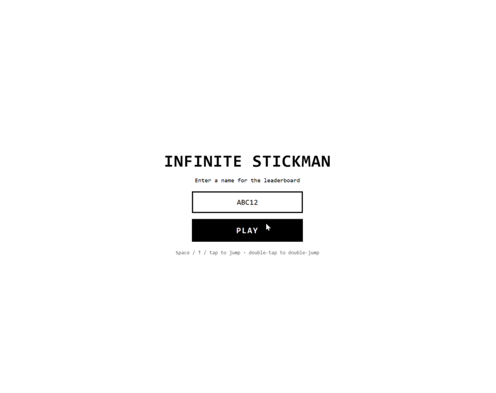
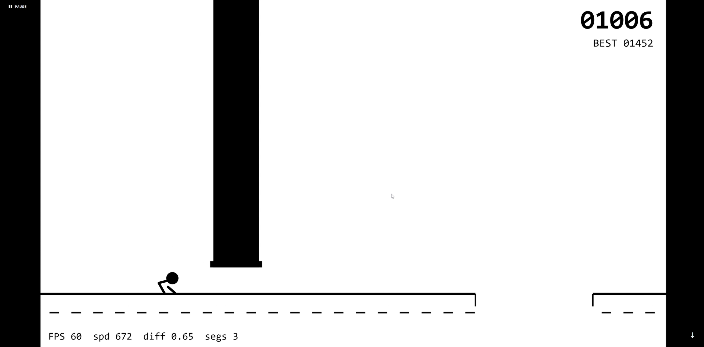
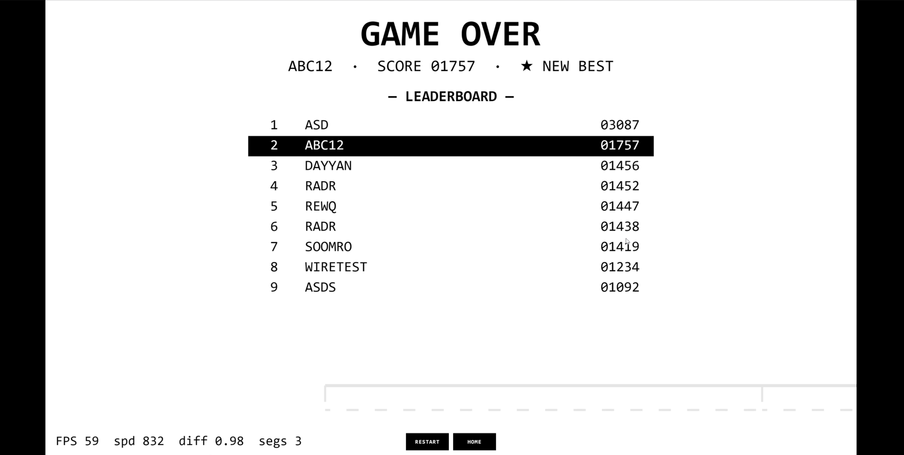

# Infinite Stickman

An endlessly scrolling monochrome arcade runner. Jump, double-jump, and duck under obstacles as the world gets faster. How far can you go?



Enter your name, hit **PLAY**, and your score goes on the global leaderboard.

---



The world accelerates the longer you survive. Jump gaps, clear triangles and stacked blocks, duck under overhead pillars — the reaction window shrinks as speed climbs.

---



Die and your run is submitted instantly. A new best is marked with a star ★. Hit **RESTART** to go again or **HOME** to change your name.

---

## Controls

| Action | Input |
|---|---|
| Jump | tap / click · `Space` · `↑` |
| Double jump | second tap/press while airborne |
| Duck / fast-fall | hold `↓` button · `↓` · `S` |
| Pause / leaderboard | **PAUSE** · `P` |
| Resume | **RESUME** · `P` |
| Restart | **RESTART** · tap · `Space` |
| Change name | **HOME** · `Esc` |

## Play

ES modules require HTTP — open from a local server, not `file://`:

```bash
python3 -m http.server 8000
# then open http://localhost:8000/
```

Landscape orientation is recommended.

## Built with

Vanilla JS · HTML5 Canvas · zero dependencies · no build step. See [`docs/`](docs/) for the full design and architecture.
